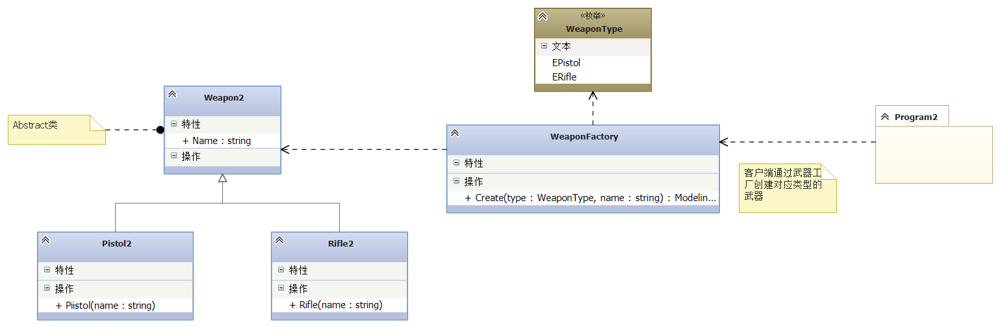
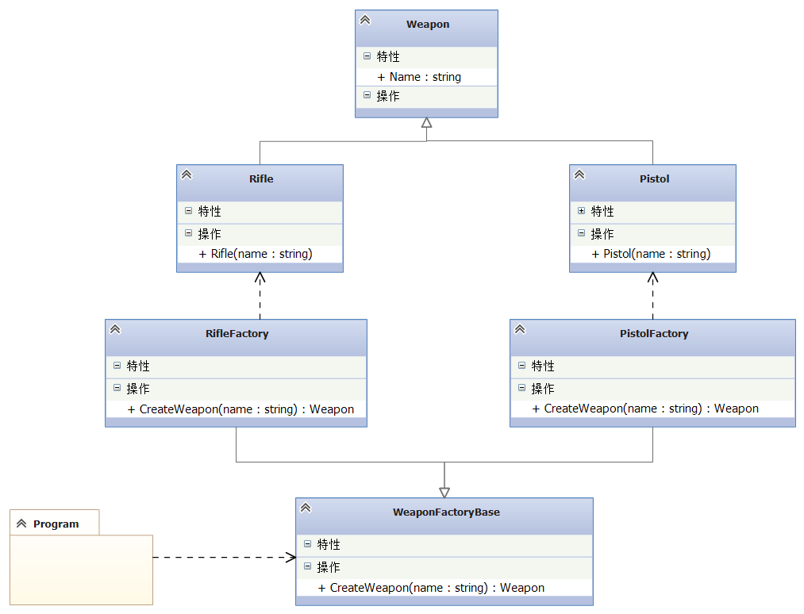
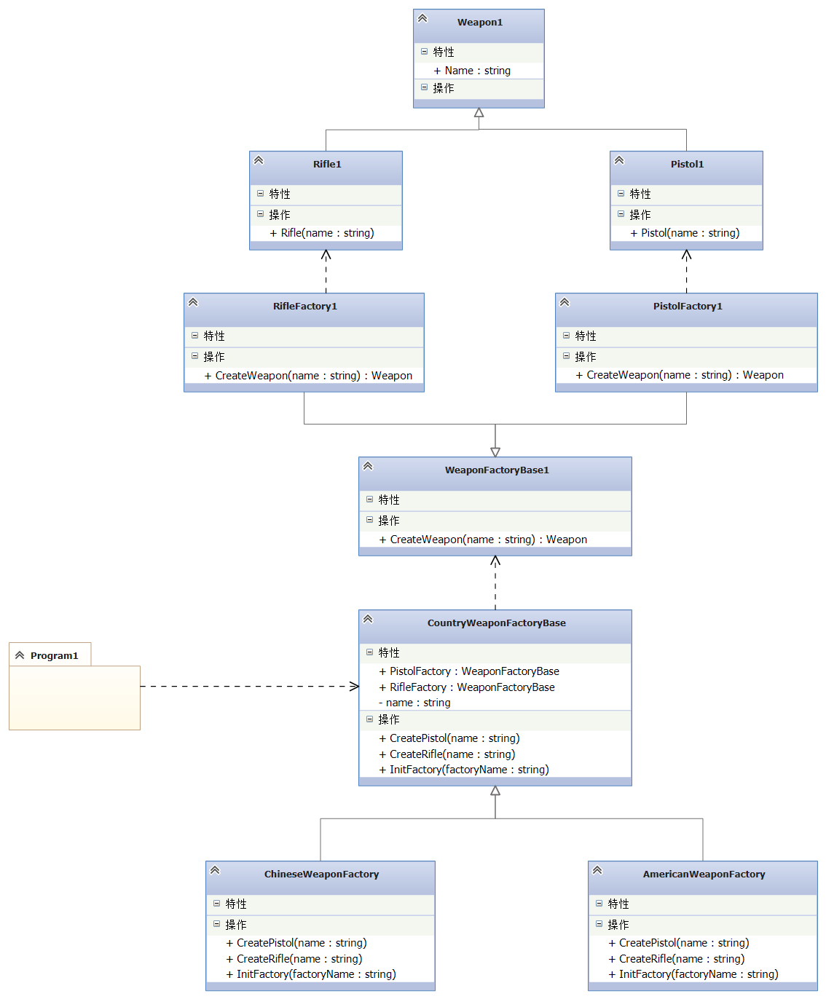

# Unity- Design-Patterns
Unity设计模式

## 开发环境
Unity2019.3

## 配套文档教程
* [前言](http://dingxiaowei.cn/2017/05/10/)
* [七大设计原则](http://dingxiaowei.cn/2017/05/11/)
* [UML入门](http://dingxiaowei.cn/2017/05/12/)
* 创建型设计模式
	* [单例模式](http://dingxiaowei.cn/2017/05/13/)
	* [工厂模式](http://dingxiaowei.cn/2017/05/14/)
	简单工厂：
	
    工厂方法：
    
    抽象工厂：
    
    * [原型模式](http://dingxiaowei.cn/2017/05/15/)
    * [建造者模式](http://dingxiaowei.cn/2017/05/16/)
* 结构型设计模式
	* [代理模式](http://dingxiaowei.cn/2017/05/17/)

## 更多教程
http://dingxiaowei.cn/tags/设计模式/
